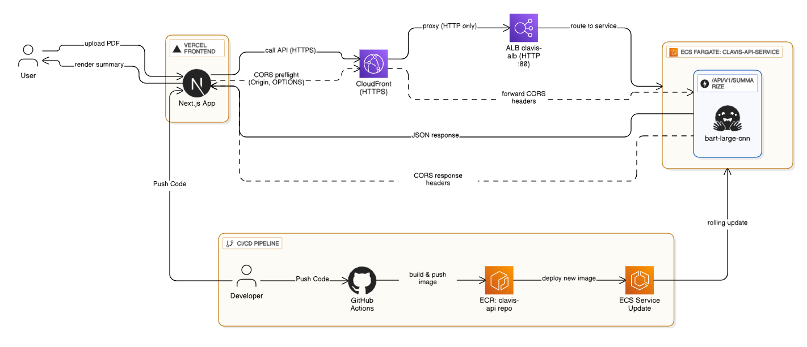

# Clavis API

A cloud-native FastAPI application for intelligent PDF summarization using machine learning, containerized with Docker, and deployed on AWS with automated CI/CD pipelines.

## Overview

Clavis API provides a scalable, AI-powered service for summarizing PDF documents. Researchers and users can upload PDFs through a Next.js frontend, and the backend processes the content using the Hugging Face BART model, returning concise summaries. The system emphasizes production-ready engineering with containerization, load balancing, and global content delivery.

## Features

- **PDF Summarization**: Extracts and summarizes text from uploaded PDFs using advanced ML models.
- **Chunking Safeguard**: Handles long documents by splitting text into manageable chunks to avoid processing timeouts.
- **CORS Support**: Configured for cross-origin requests from the Vercel-hosted frontend.
- **Containerized Deployment**: Fully dockerized for consistent environments.
- **CI/CD Automation**: GitHub Actions for automated builds, testing, and deployments.
- **Cloud-Native Architecture**: Leverages AWS ECS Fargate, CloudFront, and ECR for scalability and security.

## Tech Stack

- **Backend**: FastAPI (Python), Hugging Face Transformers, PyTorch
- **Frontend**: Next.js (hosted on Vercel)
- **Containerization**: Docker
- **Cloud**: AWS (ECS Fargate, CloudFront, ALB, ECR)
- **CI/CD**: GitHub Actions
- **Other**: PyPDF2 for PDF processing, Uvicorn for ASGI server

## Architecture

The Clavis system is designed as a fully automated, cloud-native pipeline that connects developers, infrastructure, and end users into one seamless flow.

On the developer side, code changes are pushed to GitHub, where GitHub Actions builds Docker images for the FastAPI backend, pushes them to Amazon Elastic Container Registry (ECR), and triggers an update of the ECS Fargate service, while the frontend repository is automatically deployed to Vercel through its CI/CD integration.

On the user side, researchers access the Next.js frontend hosted on Vercel to upload PDFs, which are sent via HTTPS to AWS CloudFront. CloudFront acts as the secure CDN and forwards requests to the Application Load Balancer (ALB), which distributes traffic to healthy ECS Fargate tasks running the containerized FastAPI application. Inside each container, the Hugging Face facebook/bart-large-cnn model processes the extracted text, applying a chunking safeguard to ensure responsiveness, and returns a JSON summary. The result flows back through ALB and CloudFront to the Vercel frontend, where it is displayed with a polished UI and animated typewriter effect.

This architecture demonstrates not only functional AI integration but also professional engineering practices: automated CI/CD pipelines, container orchestration, load balancing, and global content delivery, all working together to deliver a scalable and production-ready AI service.



## Prerequisites

- Python 3.11+
- Docker
- AWS CLI (for deployment)
- Git

## Installation & Local Setup

1. **Clone the repository**:
   ```
   git clone https://github.com/Mdednnjya/clavis-api.git
   cd clavis-api
   ```

2. **Install dependencies**:
   ```
   pip install -r requirements.txt
   ```

3. **Run locally**:
   ```
   uvicorn app.main:app --reload
   ```
   Access the API docs at `http://localhost:8000/docs`.

4. **Run with Docker**:
   ```
   docker build -t clavis-api .
   docker run -p 8000:8000 clavis-api
   ```

## Usage

- **API Endpoint**: `POST /api/v1/summarize`
  - Upload a PDF file via multipart/form-data.
  - Returns a JSON response with the filename and summary.

- **Example Request** (using curl):
  ```
  curl -X POST "http://localhost:8000/api/v1/summarize" \
       -H "accept: application/json" \
       -H "Content-Type: multipart/form-data" \
       -F "file=@sample.pdf"
  ```

- **Frontend**: Access the deployed Next.js app at [https://clavis-app.vercel.app/](https://clavis-app.vercel.app/) for a user-friendly interface.

## Deployment

The project uses GitHub Actions for CI/CD:
- On push to `main`, builds Docker images, pushes to ECR, and updates ECS Fargate.
- Frontend deploys automatically to Vercel.

For manual deployment:
1. Build and push image to ECR.
2. Update ECS service with the new image tag.
3. Ensure ALB and CloudFront are configured.

Refer to AWS docs for detailed ECS setup: [AWS ECS Guide](https://docs.aws.amazon.com/ecs/).

## Configuration

- **Environment Variables**: Set CORS origins in `app/main.py` (e.g., for production domains).
- **Model Settings**: Adjust chunk size and limits in `app/services/summarizer.py` for performance tuning.
- **AWS Resources**: Configure via AWS Console or CLI for ECS, ECR, CloudFront.